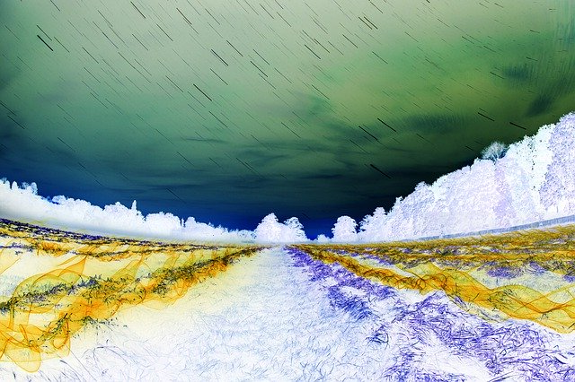

# Parallel Image Filtering System

## Overview
This project implements a high-performance **Producer-Consumer** system for parallel image processing. It uses a **Client-Server** architecture with a pool of worker processes. The system leverages **System V IPC** (Shared Memory and Semaphores) for thread-safe, starvation-free concurrent request handling.

## Features
- **Architecture:** Client-Server model with Circular Buffer in Shared Memory
- **Parallel Processing:** Dedicated worker process per request
- **Synchronization:** Producer-Consumer logic preventing starvation
- **Image Formats:** BMP (native) and PNG (custom Zlib decompression)
- **Filters:** Grayscale, Negative, Sepia
- **Robustness:** Graceful shutdown (SIGINT), zombie reaping (SIGCHLD), IPC cleanup

## Visual Example

Here is an example of an image processed by the system using the **Negative** filter (Filter ID `2`).



## Dependencies
```bash
# Ubuntu/Debian
sudo apt-get install build-essential zlib1g-dev

# macOS
brew install zlib
```

## Project Structure
```
├── src/
│   ├── client/         # Client implementation
│   ├── server/         # Server implementation
│   ├── workers/        # Worker process logic
│   └── image/          # Image processing
│       ├── formats/    # BMP and PNG parsers
│       └── filters.c   # Filter algorithms
├── include/            # Header files
├── data/               # Test images
├── tests/              # Stress tests
└── Makefile
```

## Compilation
```bash
make        # Build Server and Client
make clean  # Clean build files
```

## Usage

### Start Server
```bash
./server <buffer_size>
./server 10
```

### Run Client
```bash
./client <image_path> <filter_id>
```

**Filter IDs:**
- `1` - Grayscale
- `2` - Negative
- `3` - Sepia

## Example

```bash
./client ~/data/input.png 3
```

## Testing

**Manual Test:**
```bash
./server 5
./client ~/data/test.bmp 1
```

**Note:** Use full file paths starting with `~` (home directory) or absolute paths like `/home/username/data/image.png` for reliable image access.


## Technical Details

**IPC Mechanisms:**
- **Shared Memory:** Holds request circular buffer
- **Semaphores:** `sem_mutex`, `sem_empty`, `sem_full`
- **FIFO:** Per-client response pipe (`/tmp/fifo_rep_<PID>`)

**Shutdown:** Server catches SIGINT to cleanup IPC resources; Client unlinks response FIFO.

